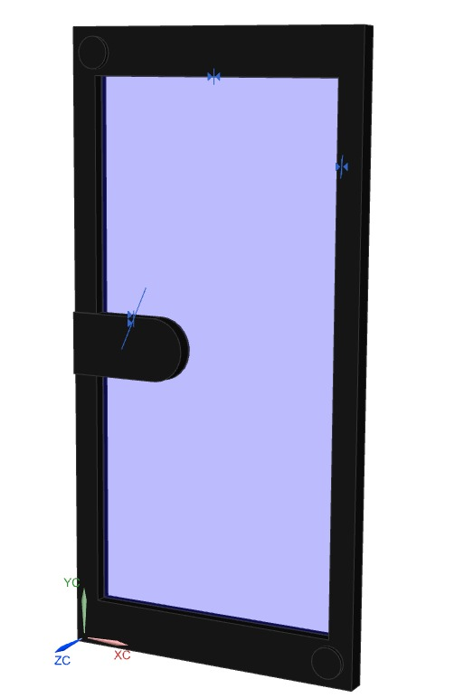
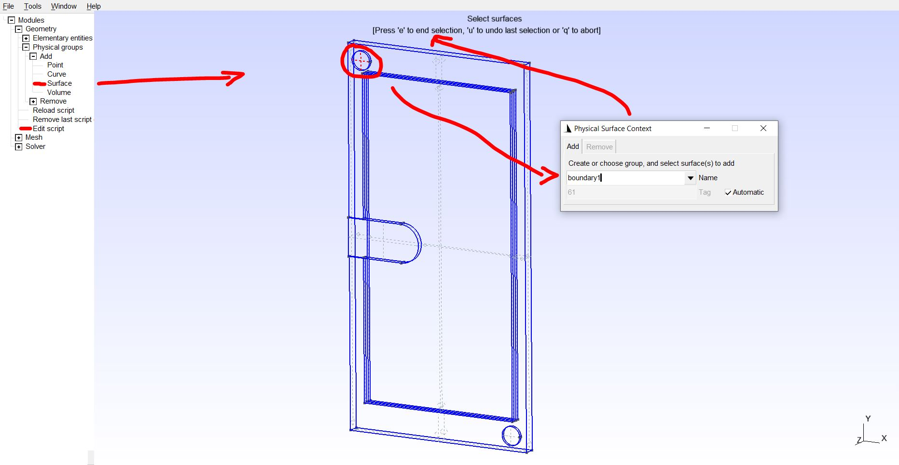
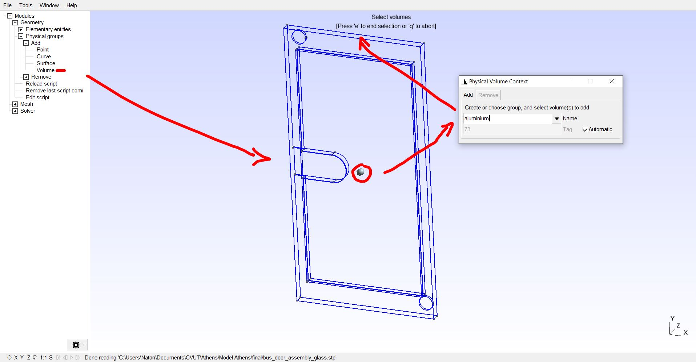
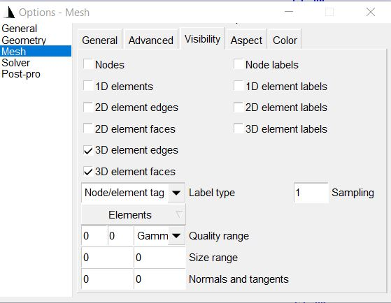
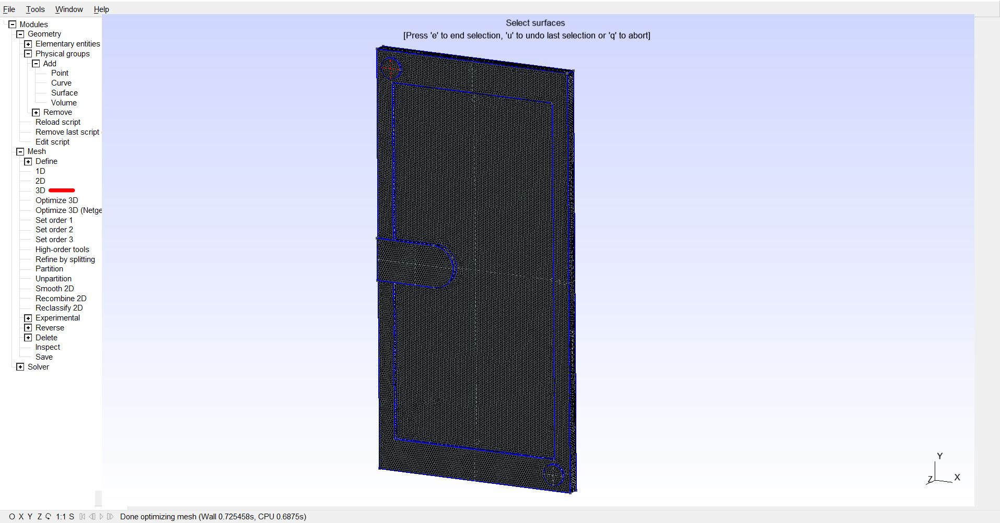
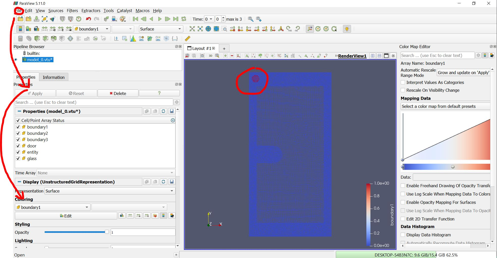
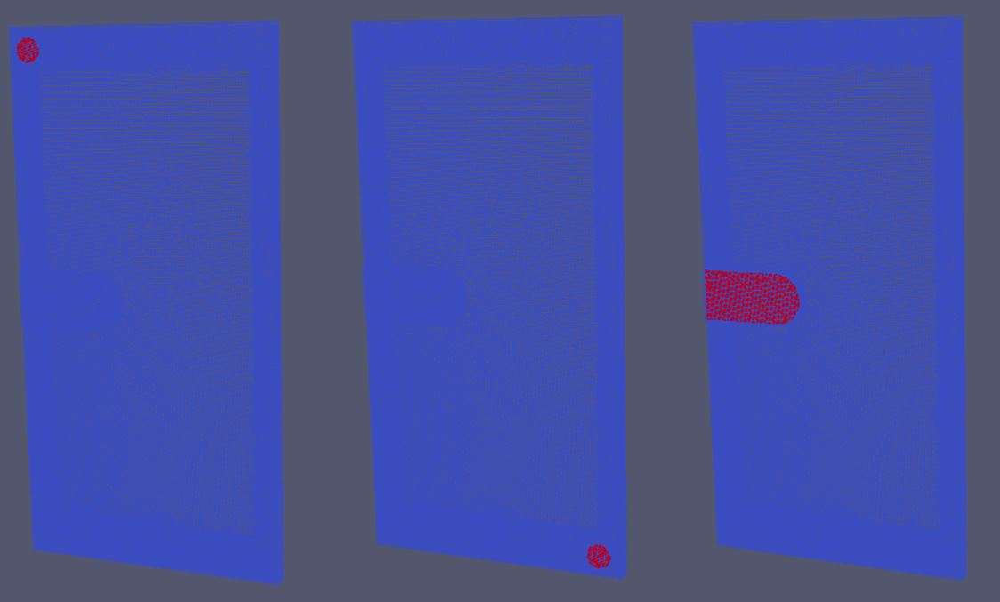
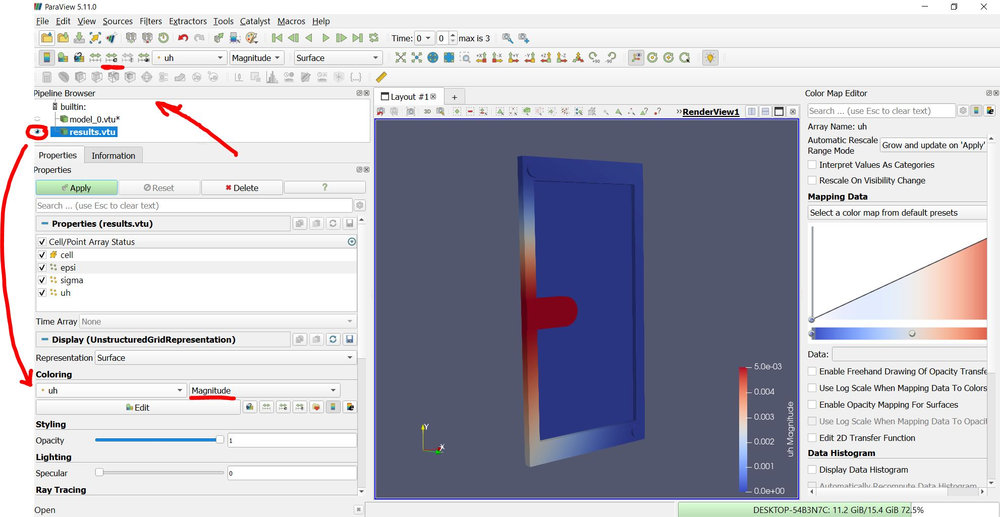
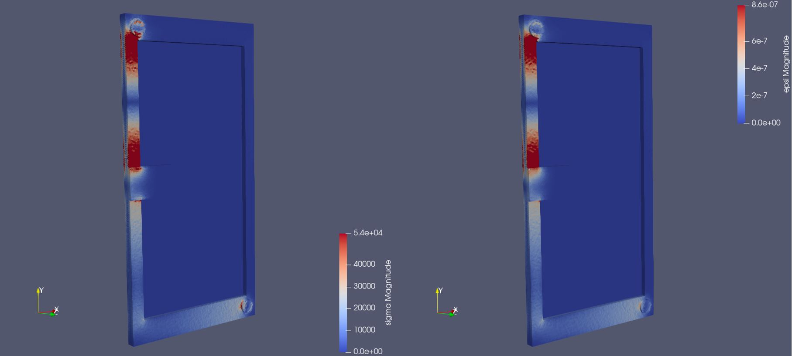

# **FEM Analysis of Bus Door  Using Julia**
## Intro
In this assignment we looked at the FEM analysis of a bus door. Doing research on [Mathematical Modeling and Numerical Simulation of Driving Busses and Vibrating Doors](https://github.com/ziolai/ventura-modeling), we got sufficient information about the topic and we could start solving the problem itself. We defined the task as a part of the door firmly connected to the bus frame in two places. At that moment, the handle surface will be pushed outwards so that the door is deformed by 5 mm. This situation simulates, for example, a bus running over a bump and a passenger hitting the door, resulting in a defined deformation. Subsequently, an FEM analysis will attempt to determine the stresses that will be generated in the remaining parts of the bus door. An example of such a door, [Masats 028C](https://www.youtube.com/watch?v=mlLqosaFMSA), can be seen below.


## Creating mesh with Gmsh
We created a basic 3D model of the bus door in 3D CAD software. The inside part is made from plexi glass, the outside part is from aluminium:



In the next part, we imported the step file into [Gmsh](https://gmsh.info/) software. The model could be also made in Gmsh, however we found it easier to just create a model in a dedicated CAD software.
> Gmsh Menu: File\Open\bus_door.stp

First task was to create boundary conditions. We chose 'Surface' from left tree and selected first surface for boundary condition. Than we named the surface and confirmed the selection with pressing 'e' (after writing a name you have to press with a mouse into free space, then press 'e'). After that, the new physical group was writen into the script. You can check it by selecting 'Edit script' in the left tree.

We created another boundary condition in the surface of bottom right circle. Finally, the last boundary condition was created in the middle of the door at the handle.
We also have to separate the glass volume from the aluminium one. To do that, select Volume in the Tree Menu on the left side, than select the frame volume (a dot in the middle), name it and confirm selection with pressing 'e'.
> Modules\Geometry\Physical groups\Volume



After creating the aluminium volume, we created the plexi-glass volume called 'glass' in a similar way by repeating the process and selecting second 'volume dot' in the middle.

Now, with physical groups set, we can happily move to another step - meshing the door. To check the mesh parameters just open:
> Gmsh Menu: Tools\Options\Mesh\General

We set smoothing steps to '5' and element size factor to '0.05', other parameters stayed in default setup.


Last but not least, we had to change mesh visibility as shown:
> Gmsh Menu: Tools\Options\Mesh\Visibility



And we are ready to mesh! Go to the right tree and select:
> Modules\Mesh\3D

Now you should see the meshed door:

Other parameters, such as algorithm, boundary nodes or polynomical order can me changed in High-order tools:
> Modules\Mesh\High/order tool

Save the mesh and you are ready for another step!
> Gmsh Menu: File\Save Mesh

## FEM with Julia
Now it is time to make FEM calculations using [Gridap](https://gridap.github.io/Tutorials/dev/pages/t003_elasticity/) library in Julia, where are also tutorials for working with FEM that have inspired us a lot.

Firstly we have to import the meshed model into Julia. Gridap doesn't support .msh files and supports only .json files. Fortunately, there is a library 'GridapGmsh' that can handle the .msh format. Remember to set the right path for the file location.
```
using Gridap
using GridapGmsh
model = GmshDiscreteModel("C:/Users/...../bus_door.msh")
```
Now that the model has been imported, we can check the correctness of the boundary condition definition.
```
writevtk(model,"model")
```
This commands saves imported model as a 'model.vtu' file into:
> C:\Users\UserName\model.vtu

To see the results, use open source post-processing app called [Paraview](https://www.paraview.org/download/). More about inspecting the model and the results is in the next chapter.

After checking the model, we can move to labeling meshed model elements. The reason we do this is because we use multiple materials and we need to assign different physical parameters.
```
using Gridap.Geometry
labels = get_face_labeling(model)
dimension = 3
tags = get_face_tag(labels,dimension)
```
Than we can assign 'glass_tag' to elements in volume 'glass':
```
const glass_tag = get_tag_from_name(labels,"glass")
```
Other parts of the door are automatically made from aluminium. If there was another material, we can add it the same way as glass.

At this point, we have to create FE space. We construct a continuous Lagrangian interpolation of order 1. We mark as Dirichlet the objects identified with the tags 'boundary1', 'boundary2' and 'boundary3' using the dirichlet_tags argument. In 'dirichlet_mask' we actually defined which components we constrained and which not. As you can see, doors cannot move in 'boundary1' and 'boundary2' and can only move in 'boundary3' in direction 'x' and 'y'.
```
order = 1

reffe = ReferenceFE(lagrangian,VectorValue{3,Float64},order)
V0 = TestFESpace(model,reffe;
  conformity=:H1,
  dirichlet_tags=["boundary1","boundary2","boundary3"],
  dirichlet_masks=[(true,true,true), (true,true,true), (true,false,false)])
```
In the next step we define the deformations on boundary conditions. As you can see, we assume that the passenger pushes on the bus door in the area of the handle, pushing the door 5 mm out of the bus ('boundary3' in direction '-z'). The door does not moove in hinges (no deformations in 'boundary1' and 'boundary2').
```
g1(x) = VectorValue(0.0,0.0,0.0)
g2(x) = VectorValue(0.0,0.0,0.0)
g3(x) = VectorValue(0.0,0.0,-0.005)
```
From functions g1, g2 and g3, we define the trial space:
```
U = TrialFESpace(V0,[g1,g2,g3])
```
We can now define the material parameters for aluminium door and plexi glass inside:
```
function lame_parameters(E,ν)
  λ = (E*ν)/((1+ν)*(1-2*ν))
  μ = E/(2*(1+ν))
  (λ, μ)
end

const E_glass = 100e9
const ν_glass = 0.37
const (λ_glass,μ_glass) = lame_parameters(E_glass,ν_glass)

const E_alu = 69.0e9
const ν_alu = 0.33
const (λ_alu,μ_alu) = lame_parameters(E_alu,ν_alu)
```
After we defined the parameters, we have to define the function containing the constitutive law:
```
function σ_bimat(ε,tag)
  if tag == glass_tag
    return λ_glass*tr(ε)*one(ε) + 2*μ_glass*ε
  else
    return λ_alu*tr(ε)*one(ε) + 2*μ_alu*ε
  end
end
```
Now it's time for the weak form definition:
```
degree = 2*order
Ω = Triangulation(model)
dΩ = Measure(Ω,degree)

a(u,v) = ∫( ε(v) ⊙ (σ_bimat∘(ε(u),tags)) )*dΩ
l(v) = 0
```
The linear form is l(v) = 0 because there are no external forces.

Now we can finally build a FE problem and solve it using commands:
```
op = AffineFEOperator(a,l,U,V0)
uh = solve(op)
```
After solving the problem, we can save the results into '.vte' file:
```
writevtk(Ω,"results",cellfields=
  ["uh"=>uh,"epsi"=>ε(uh),"sigma"=>σ_bimat∘(ε(uh),tags)])
```
Location of the saved file is again:
> C:\Users\UserName\results.vtu

## Postprocessing using Paraview
Now it is time to explore the results! Firstly download an open source post-processing app called [Paraview](https://www.paraview.org/download/) and install it. As it was said in the previous chapter, we need to firstly check created boundary conditions and imported the model. To do that, search for 'model.vtu' file and open it using Paraview upper menu:
> File\Open\

After opening the 'model.vtu' you have to click the 'Apply' button and after that you can browse through physical groups (boundary conditions and volumes) using 'Coloring' tab. All boundary conditions are shown below:


After checking boundary conditions and running the Julia script in the previous part, we can finally move to reviewing our FEM analasys results. Import the 'results.vtu' file into Paraview the same way as 'model.vtu' file. To show the results, click on the eye next to the 'results.vtu' as shown below.



Now we can go through the results in 'Coloring' tab. Selection of 'uh' show us total deformation which is 5 mm in the area of the handle. This verifies our calculation results. We can inspect the deformations in directions of x, y and z axis in the tab next to it (now selected 'Magnitude' option). The scale can be adjusted in the upper part as shown in the picture. We can countinue to review the results by going into 'sigma' and 'epsi' tabs that show us stress and strain.


As you can see, the highest stress is 54 kPa which is way less than tensile yield strength of aluminium (276 MPa). The highest strain (the ratio of change in dimension to the original dimension) is 8.6e-7.

# Conclusion
The goal of this work was to run FEM calculations of the bus door in Julia, including preprocessing and postprocessing in other open source software. Credits to [Gridap tutorials](https://www.paraview.org/download/), which helped to get the model working. Improvements can be made on the transition between the two materials. Also, the external force on the door was not described here.
